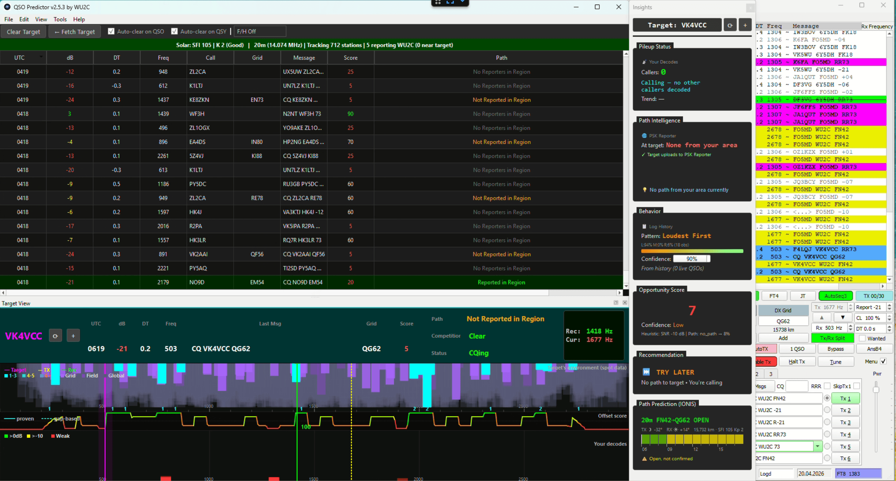

# QSO Predictor

[](https://github.com/wu2c-peter/qso-predictor/releases)
[](https://www.gnu.org/licenses/gpl-3.0)
[](https://github.com/wu2c-peter/qso-predictor/releases)

**Real-time tactical assistant for FT8/FT4 — see the band from the DX station's perspective.**



## 🆕 What's New in v2.2.0

### ⚡ Tactical Observation Toasts
Real-time event-driven alerts appear as a notification bar above the decode table:
- **Hidden pileup detection** — warns when you see few callers locally but PSK Reporter shows heavy competition at the target's end ("⚠️ Hidden pileup: 1 caller locally, 7 at target's end — you can't hear your competition")
- **Path change alerts** — instant notification when your signal is first heard by the target ("🎯 VK3ABC has decoded YOU — call now!") or when a path opens/closes
- **Competition shifts** — alerts when competition at the target increases or drops significantly
- Rate-limited (1 per 15s) and auto-dismissing (8s) to avoid distraction

### 📊 Pileup Contrast Intelligence
The Insights panel now cross-references local and target-side competition:
- Shows PSK Reporter competition count alongside your local pileup view
- **Hidden pileup warning** — highlighted alert when you see a clear band locally but the target is buried in callers you can't hear
- Feeds into strategy recommendations — "WAIT" instead of "CALL NOW" when hidden competition is heavy

### 🔍 Smarter Predictions
Improved data consistency across all displays:
- **Effective path status** — when PSK Reporter says "No Path" but Path Intelligence shows stations from your area getting through, recommendations now account for this evidence instead of being pessimistic
- **Local decode competition** — when PSK Reporter has no perspective data, the app now counts callers visible in your local decodes instead of showing "Unknown"
- **Target-side competition** feeds into success prediction and strategy recommendations for more accurate advice

### 📋 Column Header Tooltips
Hover over any column header in the decode table to see what it means and where the data comes from (e.g., "Propagation status to this station. Sources: PSK Reporter spots + local decode analysis.")

### 🐛 Critical Bug Fixes
- **Path status logic fix** — "Not Reported in Region" was incorrectly matching as "Reported in Region" due to substring collision, causing wrong colors, wrong path status, and wrong recommendations across 4 code locations
- **Path Intelligence reconciliation** — Path column and Path Intelligence widget now cross-reference each other's data sources instead of showing contradictory information
- **Toast bar readability** — proper sizing and font weight for legibility
- **Band map label spacing** — "Your decodes" label repositioned for clear visual separation

## Previous Releases

### v2.1.4
- Fixed JTDX detection in auto-paste scripts
- Band map frequency scale brightened for Windows visibility
- Auto-paste scripts now click Enable TX automatically

### v2.1.3
- Click-to-copy target callsign from either panel
- Local decode evidence for path detection (no PSK Reporter lag)
- Path column relabeled for clarity
- Combined auto-paste scripts for frequency and callsign

### v2.1.2
- **Critical fix:** Target Perspective data rejected as stale — receipt time now used instead of decode time
- Grid square validation tightened (FT8 tokens like RR73 no longer misidentified as grids)

### v2.1.1
- Band map hover tooltips (callsign, SNR, grid, tier)
- Frequency scale with Hz labels
- Resilient data source monitoring (warns when UDP/MQTT goes silent)

### v2.1.0
- **Hunt Mode** — track stations/prefixes/countries with system tray alerts
- **Path Intelligence** — see who from your area is getting through and why
- **Undockable panels** — multi-monitor layout support
- Click-to-clipboard, auto-clear on QSY, Windows UDP Error 10054 fix

---

## The Problem

You're calling a DX station. No response. Is the band dead? Is your signal too weak? Or are you buried under a pileup you can't even hear?

Traditional tools show the band from **your** perspective. QSO Predictor shows you **the DX station's** perspective.

## The Solution

Using real-time PSK Reporter data, QSO Predictor shows:
- **What the target is hearing** — signals arriving at their location
- **How crowded each frequency is** — at their end, not yours
- **Whether your signal path is open** — before you call
- **Who else from your area is getting through** — and why

## Quick Start

### Windows
1. Download latest `.zip` from [Releases](https://github.com/wu2c-peter/qso-predictor/releases)
2. Extract and run `QSO Predictor.exe`
3. Configure WSJT-X/JTDX: Settings → Reporting → UDP Server = `127.0.0.1`, Port = `2237`

### macOS / Linux (from source)
```bash
git clone https://github.com/wu2c-peter/qso-predictor.git
cd qso-predictor
pip install -r requirements.txt
python main_v2.py
```

### First-Time Setup
1. **File → Settings** — enter your callsign and grid
2. **Tools → Bootstrap Behavior** — analyze your logs for behavior prediction (optional but recommended)

## Features

### Target Perspective Band Map
See what the DX station hears, color-coded by data quality:
- **Cyan** — Target is directly decoding these signals
- **Blue tiers** — Nearby stations (proxy data)
- **Count numbers** — Signal density (1-3 ideal, 6+ crowded)

### Path Status
Your signal's reach, at a glance:
- **Heard by Target** — Target has decoded YOUR signal — call now!
- **Heard in Region** — Stations near the target heard you — path confirmed
- **Not Heard in Region** — Reporters exist but haven't heard you yet
- **Not Transmitting** — You haven't transmitted recently
- **No Reporters in Region** — No PSK Reporter data from that area
- **Analyze button** — Deep dive into why others succeed

### Local Intelligence
Predicts DX station behavior from observed patterns:
- **Loudest First** — favors strong signals
- **Methodical** — works through pileup systematically  
- **Random/Fair** — no clear preference

### Hunt Mode
Never miss a wanted station:
- Track by callsign, prefix, or country
- Desktop notifications when spotted
- Special alerts when working your area

### Smart Frequency Recommendations
- **Green line** — Algorithm's recommended TX frequency
- **Score graph** — Visual scoring across the band
- **Solid vs dotted** — Confidence indicator (proven vs estimated)

## Documentation

📖 **[User Guide](docs/USER_GUIDE.md)** — Complete usage documentation

## Keyboard Shortcuts

| Key | Action |
|-----|--------|
| Ctrl+R | Clear target selection |
| Ctrl+H | Open Hunt List |
| Ctrl+S | Open Settings |
| F1 | Open User Guide |
| F5 | Force refresh |

## Requirements

- Windows 10/11, macOS, or Linux
- Python 3.10+ (if running from source)
- WSJT-X or JTDX
- Internet connection (for PSK Reporter data)

## Version History

### v2.2.0 (February 2026)
- **NEW:** Tactical observation toasts — real-time alerts for hidden pileups, path changes, competition shifts
- **NEW:** Pileup contrast intelligence — cross-references local vs target-side competition, warns of hidden pileups
- **NEW:** Column header tooltips — hover headers for data source info
- **NEW:** Local decode competition fallback — shows caller count from local decodes when PSK Reporter has no data
- **IMPROVED:** Effective path status — near-me evidence upgrades predictions when PSK Reporter shows no path
- **IMPROVED:** Target-side competition feeds into strategy recommendations and success predictions
- **FIXED:** Critical substring matching bug — "Not Reported in Region" incorrectly matched as "Reported in Region" in 4 code locations
- **FIXED:** Path Intelligence / Path column data reconciliation
- **FIXED:** Toast bar readability and band map label spacing

### v2.1.4 (February 2026)
- **FIXED:** JTDX detection in auto-paste scripts (JTDX title contains "WSJT-X")
- **FIXED:** Band map frequency scale too dim on Windows
- **NEW:** Auto-paste scripts click Enable TX automatically after callsign paste

### v2.1.3 (February 2026)
- **NEW:** Click-to-copy target callsign from either panel
- **NEW:** Local decode evidence for path detection (no PSK Reporter lag)
- **IMPROVED:** Path column relabeled for clarity
- **FIXED:** AP codes handled correctly (stripped instead of shown as callsign)

### v2.1.2 (February 2026)
- **FIXED:** Critical bug where Target Perspective never populated — PSK Reporter spots rejected as stale due to timestamp comparison using decode time instead of receipt time (reported by Brian KB1OPD)
- **FIXED:** FT8 tokens (`RR73`) misidentified as Maidenhead grid squares, causing incorrect tiering
- **FIXED:** ICMP "connection reset" log spam — rate-limited to single message with periodic count summary

### v2.1.1 (February 2026)
- **NEW:** Band map hover tooltips — callsign, SNR, grid, tier (suggested by Brian KB1OPD)
- **NEW:** Frequency scale with Hz labels on band map (suggested by Brian KB1OPD)
- **NEW:** Resilient data source monitoring — status bar warns if UDP/MQTT data stops
- **NEW:** Diagnostic logging in analyzer for troubleshooting empty Target Perspective
- **FIXED:** Silent exception handler in analyzer that could cause empty band map with no error

### v2.1.0 (January 2026)
- **NEW:** Hunt Mode — track stations/prefixes/countries with alerts
- **NEW:** Path Intelligence — see who from your area is getting through and why
- **NEW:** Undockable panels — customize layout for multi-monitor
- **NEW:** Click-to-clipboard for frequencies
- **NEW:** Auto-clear on QSY option
- **FIXED:** Windows UDP Error 10054 crashes
- **FIXED:** Layout issues with right dock panel

### v2.0.10 (December 2025)
- **FIXED:** Critical Windows UDP Error 10054 causing crashes
- Improved error handling for network disruptions

### v2.0.9 (December 2025)
- **NEW:** Debug logging toggle (Help menu)
- **NEW:** Connection Help dialog
- **NEW:** Open Log Folder menu item
- Improved troubleshooting capabilities

### v2.0.3 (December 2025)
- **NEW:** Clear Target button and Ctrl+R shortcut
- **NEW:** Auto-clear on QSO logged
- **NEW:** Window/column size persistence
- **FIXED:** QSO Logged message parsing

### v2.0.0 (November 2025)
- **NEW:** Local Intelligence — behavior prediction from log analysis
- **NEW:** Insights Panel — pileup status, behavior, strategy recommendations
- **NEW:** Multicast UDP support (JTAlert, N3FJP compatibility)
- **NEW:** Persona-based prediction (Contest Op, Casual, DX Hunter, etc.)

### v1.3.0
- Smart frequency scoring (proven > empty)
- Score graph visualization
- Click-to-set frequency with dwell timer

### v1.2.0
- Geographic perspective engine (tiered by proximity)
- Path status column
- WSJT-X/JTDX double-click integration

### v1.0.0
- Initial release
- Real-time MQTT streaming from PSK Reporter
- Basic band map visualization

## Contributing

Contributions welcome! Please open an issue first to discuss proposed changes.

### Contributors
- **Warren KC0GU** — Hunt Mode concept, Clear Target workflow, UI persistence suggestions
- **Brian KB1OPD** — Band map tooltips and frequency scale requests, auto-clear on QSY, testing and feedback
- **Doug McDonald, CaptainBucko, Bill K3CDY, Edgar K9RE** — Beta testing and feedback

## License

This project is licensed under the GNU General Public License v3.0 — see [LICENSE](LICENSE) for details.

## Support

- **Issues:** [GitHub Issues](https://github.com/wu2c-peter/qso-predictor/issues)
- **Discussions:** [GitHub Discussions](https://github.com/wu2c-peter/qso-predictor/discussions)

---

**73 de WU2C**
