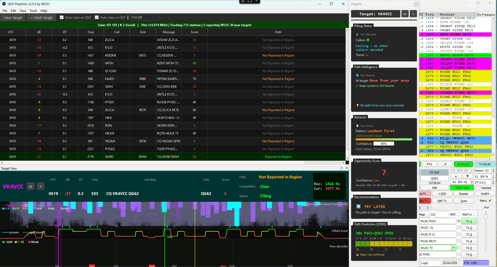
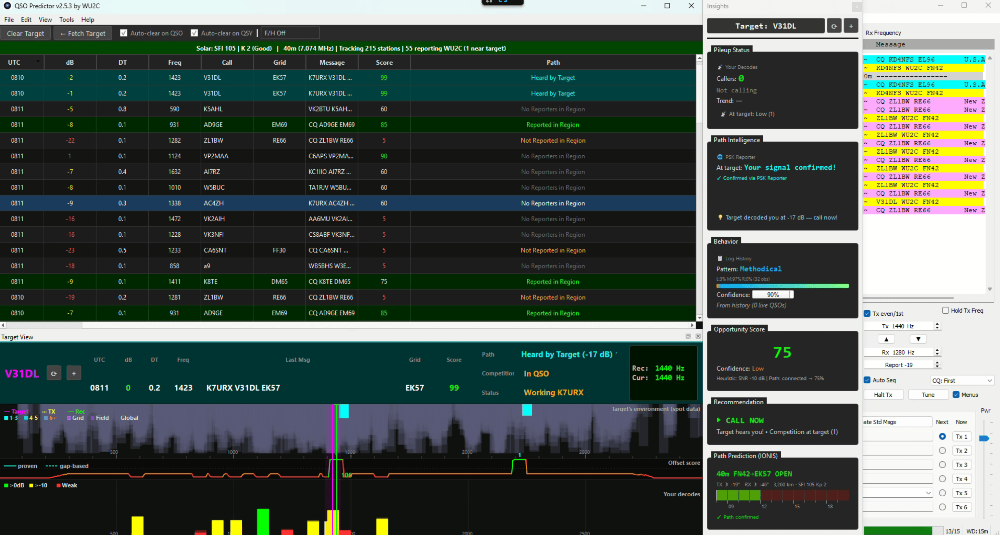
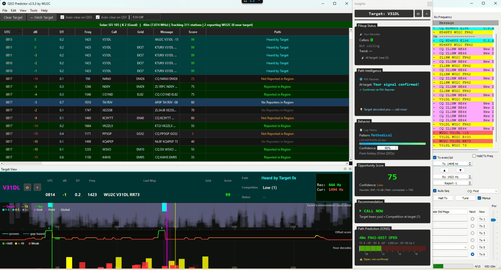

# QSO Predictor

[](https://github.com/wu2c-peter/qso-predictor/releases)
[](https://www.gnu.org/licenses/gpl-3.0)
[](https://github.com/wu2c-peter/qso-predictor/releases)

**Real-time tactical assistant for FT8/FT4 — see the band from the DX station's perspective.**



---

## QSO Predictor in Action

A real 40m FT8 QSO with **V31DL (Belize, EK57)** from Massachusetts (FN42), completed using QSO Predictor's recommendations.

### Step 1 — Target identified, all intelligence layers aligned



QSOP flagged V31DL with all four intelligence layers agreeing:

- **Path Intelligence:** Target decoded your signal at -17 dB — you're in their receiver
- **PSK Reporter:** Path confirmed via regional reporters
- **IONIS Propagation:** 40m FN42→EK57 **OPEN** (3,280 km, SFI 105, Kp 2)
- **Behavior:** Methodical operator, 90% confidence from 32 prior observations
- **Pileup:** Low competition (1 competitor at target)

Recommendation: **CALL NOW**.

### Step 2 — QSO confirmed



Clean four-message FT8 exchange with V31DL:

```
WU2C V31DL -15        ← V31DL replies with signal report
V31DL WU2C R+00       ← WU2C confirms with report back
WU2C V31DL RR73       ← V31DL seals the QSO
V31DL WU2C 73         ← WU2C final 73
```

Belize in the log. This is what "see the band from the DX station's perspective" looks like in practice — intelligence that tells you when to call, not just what you're hearing.

---

## 🆕 What's New in v2.5.3

### Disk Space Cleanup

QSOP now automatically removes an orphaned data file (`pending_observations.jsonl`) that had been accumulating silently since v2.0. This file was written by an unused training-pipeline stub — a bug in the write loop caused it to grow unboundedly, with some long-running installations seeing files in the **hundreds of gigabytes**.

* **Automatic one-time cleanup** — on first launch of v2.5.3, the orphaned file is removed. You'll see a log entry confirming how much space was freed.
* **No user data is affected** — the file had no consumer anywhere in QSOP. The Bayesian behavior predictor (active prediction path) and `outcome_history.jsonl` (OutcomeRecorder) are untouched.
* **Dead code removed** — the training-pipeline stub has been deleted from `behavior_predictor.py`. If/when an online-learning feature is ever built, it will be designed fresh with proper size bounds and a defined consumer.

**Check your disk:** if you've been running QSOP for months and have limited free space, look at `~/.qso-predictor/pending_observations.jsonl` before upgrading. On Windows that's `%USERPROFILE%\.qso-predictor\`. A large file there explains anything from a gradual SSD-full creep to dramatic overnight space loss.

---

## Previous Releases

### v2.5.2

Path status messaging polish — shorter, clearer wording with richer tooltip context on hover.

### v2.5.1

**OutcomeRecorder** — silent performance data collector. On each QSO attempt, QSOP now writes a compact record (~380 bytes) of the scoring context and three-tier outcome (`NO_RESPONSE` / `RESPONDED` / `QSO_LOGGED`) to `~/.qso-predictor/outcome_history.jsonl`. Sessions tied to operating activity, not app lifetime. No callsigns or grids stored. Enables Phase 2 self-evaluation and coaching features (planned v2.6).

### v2.5.0

**Smarter Frequency Recommendations** — scoring engine now uses regional reporter consensus to gauge confidence. Quiet slot scores scale smoothly from 50 (no reporters) to 82 (6+ reporters). Suspicious gap detection dampens empty slots flanked by heavy target decoding activity. Regional consensus recommendation when no proven Tier 1 data exists.

**Score Reason Tooltips** — hover over the score graph to see why any frequency has its current score. Plain-English explanations: "Proven: 2 signal(s) decoded by target", "Regional quiet: 5 reporter(s) in area, clear", "Suspicious gap: flanked by 6 target decodes".

### v2.4.5

Manual target entry — target any station by callsign even if not decoded locally. Click **+**, type callsign, press Enter. QSOP shows PSK Reporter perspective, path intelligence, and IONIS prediction immediately. Grid lookup cascade uses receiver cache → local decodes → DXCC prefix table. ⚠ indicator clears when station appears in local decodes.

Bug fixes: path/status bar desync for short grids, IONIS band derivation from MQTT when no UDP, DX grid capture from UDP status, band edge recommendation clamped to 300–2700 Hz.

### v2.4.3

Pileup status wording rewritten to eliminate ambiguity about data sources:
* "Calling (clear)" → **"Calling — no other callers decoded"** (unambiguous: your radio's decodes)
* "Calling (+5)" → **"Calling — 5 other callers decoded"**
* Rank preserved when available: **"Calling — #1 loudest of 5 callers"**
* Resolves the contradiction where "clear" appeared alongside a hidden pileup warning

### v2.4.2

* **FIXED:** vs-Reality comparison now checks spots from your area, not just any activity at target
* **IMPROVED:** Removed misleading dB value, added STRONG status tier, shows waiting message when grid unavailable

### v2.4.1

* **IMPROVED:** Removed misleading dB prediction in IONIS panel
* **IMPROVED:** Added STRONG status to OPEN, MARGINAL, and CLOSED predictions

### v2.4.0

**Path Prediction (IONIS)** — QSO Predictor now includes embedded HF propagation predictions powered by the [IONIS](https://ionis-ai.com) model by Greg Beam (KI7MT). A new "Path Prediction" section in the Insights Panel shows current prediction, 12-hour forecast strip, and vs-reality comparison against live PSK Reporter data. Pure numpy inference, no PyTorch dependency, runs entirely locally.

* **NEW:** Settings → Features tab with IONIS enable/disable toggle
* **FIXED:** Target grid not backfilled when set from UDP status before decodes arrive

### v2.3.5

* **FIXED:** Competition field shows "In QSO" in amber when target is working/completing with another station

### v2.3.4

* **FIXED:** NOAA solar API format change (SCN 26-21, Brian KB1OPD)
* **FIXED:** Score/Path desync — Score now recalculated on every path refresh
* **FIXED:** Misleading "CALL NOW" on UNKNOWN PathStatus → "▶ CALL (no intel)"

### v2.3.3

* **FIXED:** Target change state inconsistency — all target-change paths unified through single `_set_new_target()` handler
* **IMPROVED:** UDP silence detection — context-specific status bar warnings (bind failed, never received, data stopped)
* **CHANGED:** "Prob %" renamed to "Score", "Success Prediction" renamed to "Opportunity Score"
* **IMPROVED:** Auto-paste scripts now click "Generate Std Msgs" after pasting callsign
* **IMPROVED:** Tooltips on clickable elements mention auto-paste script integration

### v2.3.2

* **REMOVED:** Layer 2 F/H inference — either false positive or redundant; detection now via manual combo box, UDP, and SuperFox auto-detect only
* **FIXED:** Multicast UDP crash at startup (WinError 10065) — app now starts gracefully and falls back to unicast (Bob K7TM)

### v2.3.1

* **NEW:** Three-state F/H combo box — Off / F/H / SuperF/H (replaces checkbox)
* **NEW:** Disambiguation dialog when UDP detects Hound mode
* **FIXED:** 1000 Hz clamping now applies to F/H only, not SuperF/H
* **FIXED:** Path field truncation for long SNR labels

### v2.3.0

* **NEW:** Target Activity State — real-time status showing whether target is CQing, Working YOU, Working other, or Idle
* **NEW:** Fox/Hound Mode Awareness — manual combo box + WSJT-X UDP auto-detection
* **NEW:** Fox zone overlay on band map, recommendation clamping to ≥1000 Hz in F/H mode
* **NEW:** SNR at Target — surfaces PSK Reporter signal strength in Path field and Path Intelligence panel
* **NEW:** Band Edge Score Softening — gentle score ramp in 200–300 Hz and 2700–2800 Hz zones

### v2.2.1

* **FIXED:** Critical bug — local decode competition data incorrectly triggered "hidden pileup" warnings when PSK Reporter had zero perspective data from target's area

### v2.2.0

* **NEW:** Tactical observation toasts — real-time alerts for hidden pileups, path changes, competition shifts
* **NEW:** Pileup contrast intelligence — cross-references local vs target-side competition
* **NEW:** Column header tooltips
* **NEW:** Local decode competition fallback
* **FIXED:** Critical substring matching bug — "Not Reported in Region" incorrectly matched as "Reported in Region"

### v2.1.4

* Fixed JTDX detection in auto-paste scripts
* Band map frequency scale brightened for Windows visibility
* Auto-paste scripts click Enable TX automatically

### v2.1.3

* Click-to-copy target callsign from either panel
* Local decode evidence for path detection
* Path column relabeled for clarity

### v2.1.2

* **FIXED:** Target Perspective never populated — receipt time now used instead of decode time
* Grid square validation tightened

### v2.1.1

* Band map hover tooltips (callsign, SNR, grid, tier)
* Frequency scale with Hz labels
* Resilient data source monitoring

### v2.1.0

* **NEW:** Hunt Mode — track stations/prefixes/countries with alerts
* **NEW:** Path Intelligence — see who from your area is getting through and why
* **NEW:** Undockable panels — multi-monitor layout support
* Click-to-clipboard, auto-clear on QSY, Windows UDP Error 10054 fix

---

## The Problem

You're calling a DX station. No response. Is the band dead? Is your signal too weak? Or are you buried under a pileup you can't even hear?

Traditional tools show the band from **your** perspective. QSO Predictor shows you **the DX station's** perspective.

## The Solution

Using real-time PSK Reporter data, QSO Predictor shows:

* **What the target is hearing** — signals arriving at their location
* **How crowded each frequency is** — at their end, not yours
* **Whether your signal path is open** — before you call
* **Who else from your area is getting through** — and why

## Quick Start

### Windows

**Option A (recommended):** Download the latest `.zip` from [Releases](https://github.com/wu2c-peter/qso-predictor/releases), extract, and run `QSO Predictor.exe`.

**Option B (from source):** Install Python 3.10+, then:
```
git clone https://github.com/wu2c-peter/qso-predictor.git
cd qso-predictor
pip install -r requirements.txt
python main_v2.py
```

### macOS

**Option A (recommended):** Download the latest `.dmg` from [Releases](https://github.com/wu2c-peter/qso-predictor/releases) and drag QSO Predictor to Applications.

**Option B (from source):** Install Python 3.10+, then:
```
git clone https://github.com/wu2c-peter/qso-predictor.git
cd qso-predictor
pip install -r requirements.txt
python main_v2.py
```

### Linux

No pre-built binary yet — run from source. Install Python 3.10+, then:
```
git clone https://github.com/wu2c-peter/qso-predictor.git
cd qso-predictor
pip install -r requirements.txt
python main_v2.py
```

### Configure WSJT-X/JTDX (all platforms)

Settings → Reporting → UDP Server = `127.0.0.1`, Port = `2237`. Check "Accept UDP Requests".

### First-Time Setup

1. **File → Settings** — enter your callsign and grid
2. **Tools → Bootstrap Behavior** — analyze your logs for behavior prediction (optional but recommended)

## Features

### Target Perspective Band Map

See what the DX station hears, color-coded by data quality:

* **Cyan** — Target is directly decoding these signals
* **Blue tiers** — Nearby stations (proxy data)
* **Count numbers** — Signal density (1-3 ideal, 6+ crowded)

### Path Status

Your signal's reach, at a glance:

* **Heard by Target** — Target has decoded YOUR signal — call now!
* **Heard in Region** — Stations near the target heard you — path confirmed
* **Not Heard in Region** — Reporters exist but haven't heard you yet
* **Not Transmitting** — You haven't transmitted recently
* **No Reporters in Region** — No PSK Reporter data from that area
* **Analyze button** — Deep dive into why others succeed

### Target Activity State

Real-time status of what the target station is doing:

* **CQing** — Target is calling CQ — open for contacts
* **Working YOU** — Target is in QSO with you
* **Working [call]** — Target is in QSO with another station
* **Idle** — No recent target activity

### Fox/Hound Mode Awareness

* Detection via manual combo box, WSJT-X UDP, and SuperFox auto-detect
* Fox zone overlay on band map (0–1000 Hz dimmed)
* Recommendations clamped to ≥1000 Hz in F/H mode
* Full SuperFox/SuperHound support with disambiguation dialog

### Local Intelligence

Predicts DX station behavior from observed patterns:

* **Loudest First** — favors strong signals
* **Methodical** — works through pileup systematically
* **Random/Fair** — no clear preference

### Hunt Mode

Never miss a wanted station:

* Track by callsign, prefix, or country
* Desktop notifications when spotted
* Special alerts when working your area

### Smart Frequency Recommendations

* **Green line** — Algorithm's recommended TX frequency
* **Score graph** — Visual scoring across the band
* **Solid vs dotted** — Confidence indicator (proven vs estimated)

### Path Prediction (IONIS)

Physics-based HF propagation prediction powered by [IONIS](https://ionis-ai.com) (KI7MT):

* Predicts whether FT8 can travel from your station to the target
* 12-hour forecast strip shows when the path opens and closes
* Compares prediction against live PSK Reporter data — flags unexpected openings
* Runs entirely locally — no internet required for predictions
* Enable/disable in Settings → Features

## Documentation

📖 **[User Guide](docs/USER_GUIDE.md)** — Complete usage documentation

## Keyboard Shortcuts

| Key | Action |
|-----|--------|
| Ctrl+R | Clear target selection |
| Ctrl+H | Open Hunt List |
| Ctrl+S | Open Settings |
| F1 | Open User Guide |
| F5 | Force refresh |

## Requirements

* Windows 10/11, macOS, or Linux
* Python 3.10+ (if running from source)
* WSJT-X or JTDX
* Internet connection (for PSK Reporter data; Path Prediction works offline)

## Version History

### v2.4.3 (April 2026)
* **IMPROVED:** Pileup status wording — "Calling (clear)" replaced with unambiguous "Calling — no other callers decoded" to eliminate contradiction with hidden pileup warnings

### v2.4.2 (April 2026)
* **FIXED:** vs-Reality comparison now checks spots from your area, not just any activity at the target
* **IMPROVED:** Removed misleading dB value, added STRONG status tier, shows waiting message when grid unavailable

### v2.4.1 (April 2026)
* **IMPROVED:** Removed dB from IONIS prediction display, added STRONG status

### v2.4.0 (April 2026)
* **NEW:** Path Prediction — embedded IONIS V22-gamma propagation model by KI7MT. Predicts HF path viability using SFI, Kp, and sun position. 12-hour forecast strip, vs-reality comparison against PSK Reporter data. Pure numpy inference, no PyTorch dependency.
* **NEW:** Settings → Features tab with IONIS enable/disable toggle
* **FIXED:** Target grid not backfilled when set from UDP status before decodes arrive

### v2.3.5 (April 2026)
* **FIXED:** Competition field shows "In QSO" in amber when target is working/completing with another station

### v2.3.4 (April 2026)
* **FIXED:** Solar data (SFI/K-index) showing zeros — NOAA changed JSON format on March 31 (SCN 26-21). Now handles both old and new formats. (Brian KB1OPD)
* **FIXED:** Score/Path desync — Score column now recalculated on every path refresh, no more stale 99s on stations whose path degraded
* **FIXED:** Misleading "CALL NOW" when no PSK Reporter coverage at target — now shows "CALL (no intel)" in muted blue

### v2.3.3 (March 2026)
* **FIXED:** Target change state inconsistency — dashboard, band map, and insights panel could show stale data from previous target. All target-change paths now unified through single handler.
* **IMPROVED:** UDP silence detection — status bar now warns with specific messages when no data is being received (bind failed, never received, data stopped)
* **CHANGED:** "Prob %" column renamed to "Score" — it's an opportunity score, not a statistical probability. "Success Prediction" panel renamed to "Opportunity Score"
* **IMPROVED:** Auto-paste scripts now click "Generate Std Msgs" after pasting callsign to DX Call field
* **IMPROVED:** Tooltips on clickable elements mention auto-paste script integration

### v2.3.2 (March 2026)
* **REMOVED:** Layer 2 F/H inference — either false positive or redundant; detection now via manual combo box, UDP, and SuperFox auto-detect only
* **FIXED:** Multicast UDP crash at startup (WinError 10065) — app now starts gracefully and falls back to unicast (Bob K7TM)

### v2.3.1 (March 2026)
* **NEW:** Three-state F/H combo box — Off / F/H / SuperF/H
* **NEW:** Disambiguation dialog for F/H mode detection
* **FIXED:** 1000 Hz clamping now applies to F/H only, not SuperF/H
* **FIXED:** Path field truncation for long SNR labels

### v2.3.0 (March 2026)
* **NEW:** Target Activity State (CQing/Working YOU/Working other/Idle)
* **NEW:** Fox/Hound Mode Awareness — manual combo box + WSJT-X UDP auto-detection
* **NEW:** SNR at Target in Path field and Path Intelligence
* **NEW:** Band Edge Score Softening (200–300 Hz and 2700–2800 Hz zones)

### v2.2.1 (February 2026)
* **FIXED:** Local decode competition incorrectly triggering hidden pileup warnings when PSK Reporter had no target-area data

### v2.2.0 (February 2026)
* **NEW:** Tactical observation toasts
* **NEW:** Pileup contrast intelligence
* **NEW:** Column header tooltips
* **FIXED:** Critical substring matching bug in path status

### v2.1.4 (February 2026)
* Fixed JTDX detection, band map scale, auto-paste Enable TX

### v2.1.3 (February 2026)
* Click-to-copy callsign, local decode path evidence, path column clarity

### v2.1.2 (February 2026)
* **FIXED:** Target Perspective stale data rejection bug (Brian KB1OPD)
* Grid square validation fix

### v2.1.1 (February 2026)
* Band map tooltips, frequency scale, resilient data monitoring

### v2.1.0 (January 2026)
* Hunt Mode, Path Intelligence, undockable panels

### v2.0.0 (November 2025)
* Local Intelligence, Insights Panel, Multicast UDP, persona prediction

### v1.x
* Band map, path status, WSJT-X/JTDX integration, frequency scoring

## Contributing

Contributions welcome! Please open an issue first to discuss proposed changes.

### Contributors

* **Brian KB1OPD** — SuperFox/SuperHound live testing (CY0S), F/H false positive report, band map and tooltip requests, extensive beta testing
* **Warren KC0GU** — Hunt Mode concept, Clear Target workflow, UI persistence suggestions
* **Bob K7TM** — Multicast crash bug report
* **Doug McDonald, CaptainBucko, Bill K3CDY, Edgar K9RE** — Beta testing and feedback
* **Jallu OH4NDU** — Linux testing

## Privacy

QSO Predictor does not collect, store, or transmit personal information. All data stays on your local device. See the [Privacy Policy](PRIVACY.md) for details.

## License

QSO Predictor is licensed under the **GNU General Public License v3.0** — see [LICENSE.txt](LICENSE.txt) for the full license text.

For attribution of third-party dependencies and bundled models (including the IONIS propagation model by Greg Beam, KI7MT), see [THIRD_PARTY_NOTICES.md](THIRD_PARTY_NOTICES.md).

For a summary index of every license in use across QSO Predictor and its dependencies, see [DEPENDENCY_LICENSES.md](DEPENDENCY_LICENSES.md).

## Support

* **Issues:** [GitHub Issues](https://github.com/wu2c-peter/qso-predictor/issues)
* **Discussions:** [GitHub Discussions](https://github.com/wu2c-peter/qso-predictor/discussions)

---

**73 de WU2C**
